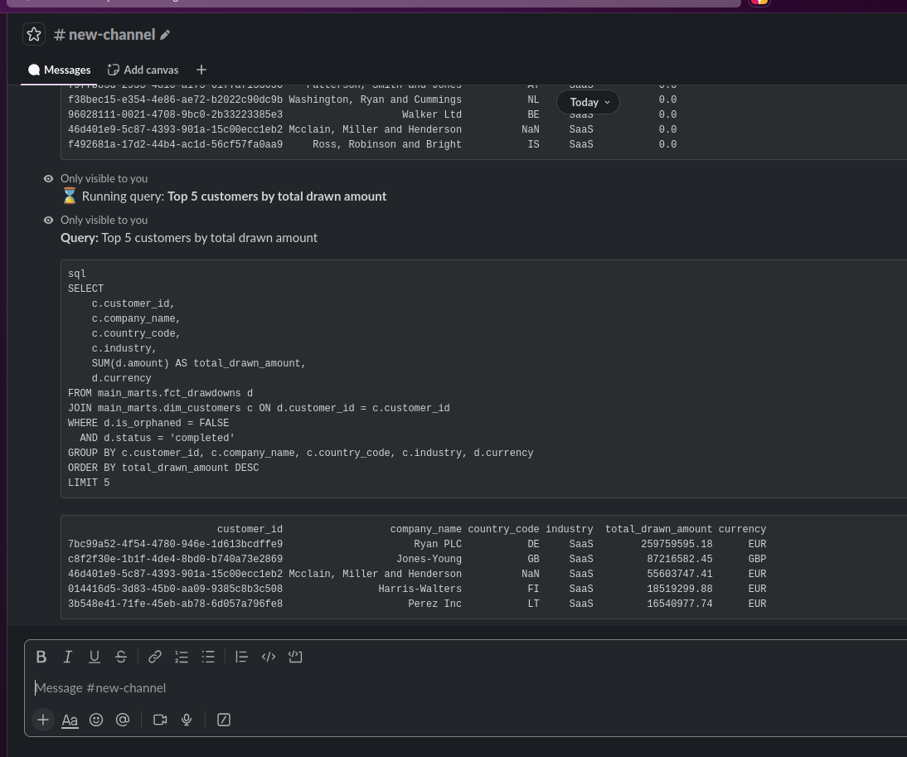
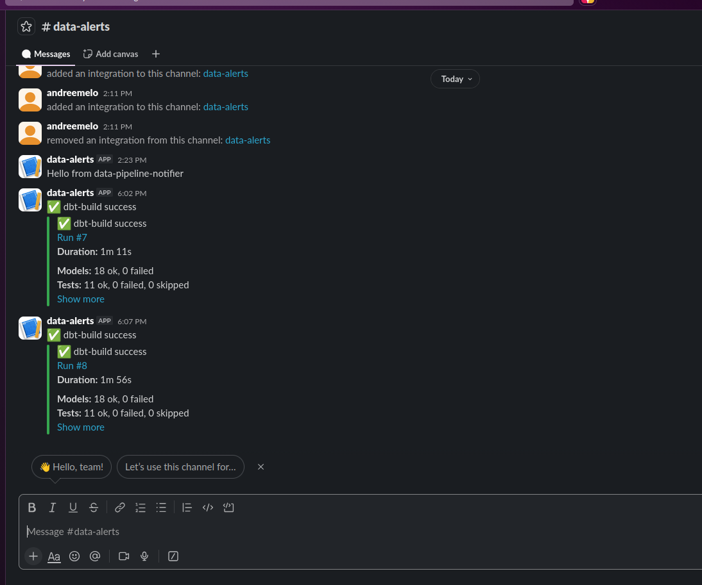
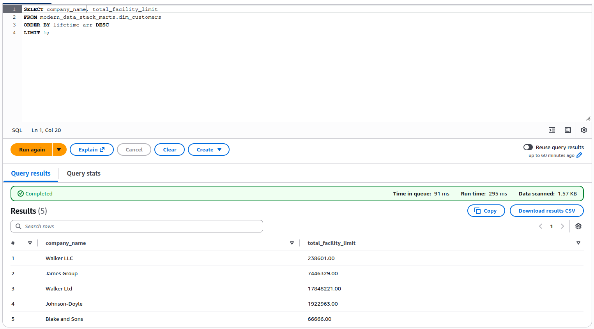

# modern-data-stack-starter

> **Ask your warehouse in plain English. From Slack, from a terminal, or from any Glue-aware engine.**
> A complete fintech data stack — synthetic data → S3 → dbt → DuckDB warehouse — with a natural-language `/query` bot in Slack, pipeline alerts in `#data-alerts`, and an open Parquet/Glue catalog so Athena/Snowflake/BigQuery read the same marts. Runs at a low monthly cost.

-----

## The stack at a glance

Each layer below is one short section in this README; the **Deep dive** column points to the document with the full rationale, trade-offs, and "when does this break?" trigger.

| #   | Layer            | Tool                                       | One-line why                                                                | Deep dive |
|-----|------------------|--------------------------------------------|-----------------------------------------------------------------------------|-----------|
| 1   | Ingestion        | dlt (default) or Airbyte (UI option)       | Code-first by default; UI when non-engineers add sources                    | [ingestion.md](docs/ingestion.md) |
| 2   | Storage          | Amazon S3 + Parquet (Iceberg-ready)        | Open format; partition layout works with Iceberg later                      | [architecture.md → Storage](docs/architecture.md#layers) |
| 3   | Transformation   | dbt Core + DuckDB                          | Zero license cost; DuckDB handles 100s of GB on one machine                 | [marts.md](docs/marts.md), [ADR-0001](docs/decisions/0001-duckdb-execution.md) |
| 4   | Orchestration    | GitHub Actions cron                        | Ephemeral runners; minimal cost for typical use                             | [orchestration.md](docs/orchestration.md) |
| 5   | Ad-hoc analytics | Claude API → DuckDB SQL (CLI + Slack `/query`) | Natural-language → SQL → result; from terminal or any Slack channel     | [analytics/README.md](analytics/README.md), [ADR-0004](docs/decisions/0004-slack-query-bot.md) |
| 6   | Observability    | GitHub Actions → Slack incoming webhook    | Surface failures where the team already lives                               | [ADR-0003](docs/decisions/0003-slack-observability.md) |
| 7   | Open catalog     | S3 Parquet → AWS Glue Data Catalog         | Athena/Snowflake/BigQuery/Trino read the same marts DuckDB does             | [transformation/exports/README.md](transformation/exports/README.md) |

The stack is shaped by four constraints: **low monthly cost**, **one operator**, **no proprietary lock-in**, and **a clear next move per layer** — see [docs/architecture.md](docs/architecture.md) for the phase plan and [docs/evolution-triggers.md](docs/evolution-triggers.md) for "when X breaks, swap to Y".

-----

## 1. Ingestion

dlt is the default for engineer-driven sources; Airbyte slots in when a non-engineer needs a UI. For local development, [`ingestion/scripts/generate_dummy_data.py`](ingestion/scripts/generate_dummy_data.py) produces a deliberately *dirty* synthetic dataset (late-arriving rows, duplicates, mixed currencies, ~2-5 % orphaned FKs) so the modelling layer has to deal with the things that actually break in production.

Deep dive: [docs/ingestion.md](docs/ingestion.md) (Airbyte vs. dlt vs. Meltano vs. Fivetran vs. CDC vs. OCR).

-----

## 2. Storage

Raw and curated layers both live on S3 in Parquet:

```
s3://${S3_BUCKET}/
├── raw/<source>/<table>/year=…/month=…/day=…/*.parquet   # ingestion lands here
└── marts/<table>/<table>.parquet                          # exports/export_marts.py
```

Parquet keeps the catalog open; the partition layout works with Iceberg the day you want it. Deep dive: [architecture.md → Storage](docs/architecture.md#layers).

-----

## 3. Transformation

dbt + DuckDB. Three layers — `stg_*` (typed/renamed), `int_*` (joins, FX normalisation), and the marts:

| Marts | |
|---|---|
| Facts | `fct_drawdowns`, `fct_repayments`, `fct_fx_transactions` |
| Dimensions | `dim_customers`, `dim_credit_facilities` |

DuckDB runs inside the GitHub Actions runner against `prod.duckdb`, which round-trips through S3 between runs. Deep dive: [marts.md](docs/marts.md), [ADR-0001](docs/decisions/0001-duckdb-execution.md). Schema and dirty-data spec: [test-data-specification.md](docs/test-data-specification.md).

-----

## 4. Orchestration

Two GitHub Actions workflows, both ephemeral, both free-tier-friendly:

- `.github/workflows/ingest.yml` — manual / on-demand ingestion run.
- `.github/workflows/dbt-build.yml` — every 6 hours: `dbt build` → export marts to S3 → post Slack summary.

No always-on infra. The runner spins up, does work, posts results, and exits. Deep dive: [orchestration.md](docs/orchestration.md) (pricing math, escape hatches to Lambda/Fargate/Modal).

-----

## 5. Ad-hoc analytics — CLI + Slack `/query`

Same NL→SQL pipeline (`analytics/query_lib.py`), two front ends. Schema is prompt-cached so a session of related questions costs very little after the first call.

**From a terminal:**

```bash
$ python analytics/query.py "Top 5 customers by total drawn amount"
```

**From Slack** — type `/query` in any channel the bot is in:

<!-- screenshot: Slack thread showing `/query Top 5 customers by total drawn amount` and the bot's reply (question + SQL block + result table). Save as docs/images/slack-query-example.png -->


The Slack bot is a small local Python process (`analytics/slack_bot.py`) connected via **Socket Mode** — no public URL, no Lambda, no API Gateway. Stop the process and the cost goes to zero. Deep dive: [analytics/README.md](analytics/README.md), [ADR-0004](docs/decisions/0004-slack-query-bot.md).

-----

## 6. Observability — pipeline alerts in Slack

Every workflow run posts a structured card to `#data-alerts` via an incoming webhook (`orchestration/scripts/notify_slack.py`). Success cards summarise models/tests/freshness; failure cards include the first 20 error lines so on-call can triage without opening the run.

<!-- screenshot: a `#data-alerts` thread showing one success card and one failure card from dbt-build. Save as docs/images/slack-alerts-example.png -->


Deep dive: [ADR-0003](docs/decisions/0003-slack-observability.md).

-----

## 7. Open catalog — Athena, Snowflake, anything Glue-aware

After every `dbt-build`, `transformation/exports/export_marts.py` writes each mart to `s3://${S3_BUCKET}/marts/<table>/<table>.parquet`. A one-time DDL run registers them in **AWS Glue Data Catalog**, after which any Glue-aware engine reads the same tables DuckDB does.

<!-- screenshot: Athena Query Editor running `SELECT company_name, lifetime_arr FROM modern_data_stack_marts.dim_customers ORDER BY lifetime_arr DESC LIMIT 5` with results visible. Save as docs/images/athena-query.png -->


Deep dive (database creation, per-mart DDL, troubleshooting): [transformation/exports/README.md](transformation/exports/README.md).

-----

## Try it locally in 5 minutes

```bash
git clone https://github.com/andrefsmelo/modern-data-stack-starter.git
cd modern-data-stack-starter

# 1. Python env (uv installs Python 3.11+ for you)
uv venv && source .venv/bin/activate
uv pip install dbt-duckdb pandas pyarrow faker boto3 numpy anthropic duckdb pyyaml \
               slack_bolt slack_sdk

# 2. Generate synthetic fintech data locally (no S3 needed for the demo path)
cp .env.example .env
python ingestion/scripts/generate_dummy_data.py

# 3. Build the warehouse (creates prod.duckdb)
cd transformation/dbt && dbt build && cd ../..

# 4. Ask it a question — from the CLI...
export ANTHROPIC_API_KEY=sk-ant-...
python analytics/query.py "Top 5 customers by total drawn amount"

# 5. ...or from Slack (after the 5-min Slack App setup, see analytics/README.md)
python analytics/slack_bot.py
```

For the full S3-backed setup (raw data in S3, dbt round-tripping `prod.duckdb`, GitHub Actions on a cron, Slack alerts wired in), follow [docs/setup.md](docs/setup.md).

-----

## Design docs

The most useful part of the project for a reviewer is probably the design docs. Each one walks through the option space, the trade-offs, and the chosen path:

| Document                                                                       | What it covers                                                                                       |
|--------------------------------------------------------------------------------|------------------------------------------------------------------------------------------------------|
| [setup.md](docs/setup.md)                                                      | Step-by-step setup walkthrough (two paths: local demo or full S3-backed stack)                       |
| [architecture.md](docs/architecture.md)                                        | Layered phase plan, cost model, naming conventions, what's intentionally out of scope                |
| [ingestion.md](docs/ingestion.md)                                              | Airbyte vs. dlt vs. Meltano vs. Fivetran vs. CDC vs. OCR — when to pick which                        |
| [orchestration.md](docs/orchestration.md)                                      | Ephemeral compute pattern, GitHub Actions pricing math, escape hatches (Lambda, Fargate, Modal)      |
| [evolution-triggers.md](docs/evolution-triggers.md)                            | Per-layer signals that say "upgrade *this* layer first" — volume, sources, latency, document inputs  |
| [decisions/0001-duckdb-execution.md](docs/decisions/0001-duckdb-execution.md)  | Why DuckDB runs inside CI with `prod.duckdb` round-tripping through S3                               |
| [decisions/0003-slack-observability.md](docs/decisions/0003-slack-observability.md) | Why pipeline alerts go to Slack via incoming webhook, what the payload looks like               |
| [decisions/0004-slack-query-bot.md](docs/decisions/0004-slack-query-bot.md)    | Why the `/query` bot is a local Socket Mode process, not Lambda + API Gateway                        |
| [marts.md](docs/marts.md)                                                      | Marts schema overview, example SQL, and how to ask the warehouse questions in natural language       |
| [test-data-specification.md](docs/test-data-specification.md)                  | Schemas, dirty-data rules, and partition layout for the synthetic dataset                            |

-----

## Project structure

```
modern-data-stack-starter/
├── analytics/                    # NL→SQL pipeline
│   ├── query.py                  #   CLI entry point
│   ├── slack_bot.py              #   Slack /query bot (Socket Mode)
│   └── query_lib.py              #   shared schema + Claude prompt
├── ingestion/
│   └── scripts/                  # synthetic data generator + S3 uploader
├── transformation/
│   ├── dbt/
│   │   └── models/
│   │       ├── staging/          # one model per source table (typed, renamed)
│   │       ├── intermediate/     # joins + business logic
│   │       └── marts/
│   │           ├── facts/        # fct_drawdowns, fct_repayments, fct_fx_transactions
│   │           └── dimensions/   # dim_customers, dim_credit_facilities
│   └── exports/                  # marts → S3 Parquet + Glue DDL for Athena/Snowflake/BQ
├── orchestration/
│   └── scripts/                  # notify_slack.py — pipeline alerts
├── .github/workflows/            # ingest.yml (manual), dbt-build.yml (cron)
├── docs/                         # architecture, ingestion landscape, orchestration, setup, ADRs
└── .env.example
```

-----

## What's next

- **Visualization layer** — a BI tool wired to `prod.duckdb`. The previous Metabase + Docker integration was removed; the next iteration will likely use a tool that reads DuckDB natively (Evidence.dev, Streamlit, or similar) to avoid Alpine/glibc driver friction.
- **Iceberg layer** on top of S3, so DuckDB and a future BigQuery/Snowflake instance can read the same raw layer.
- **Document-extraction example** — landing a PDF invoice, extracting structured fields with a hosted model, joining the result against the lending models.
