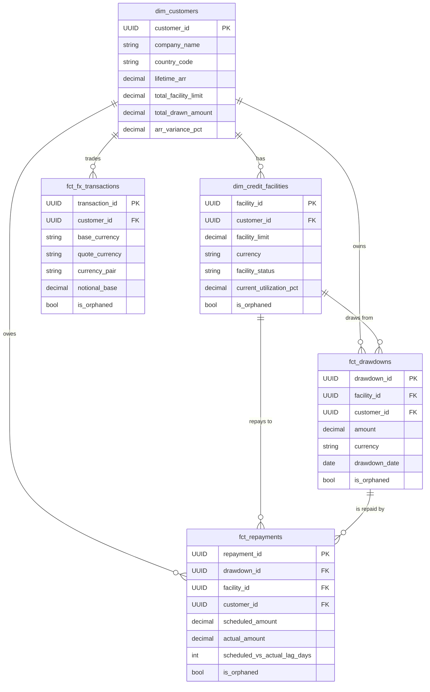
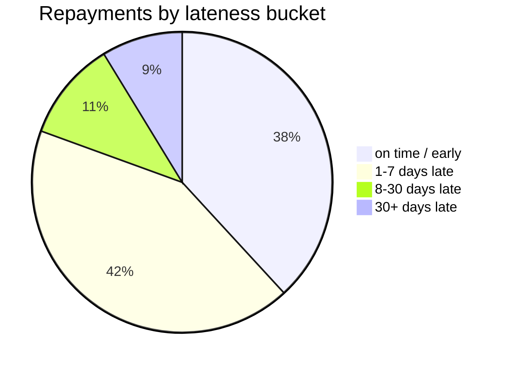
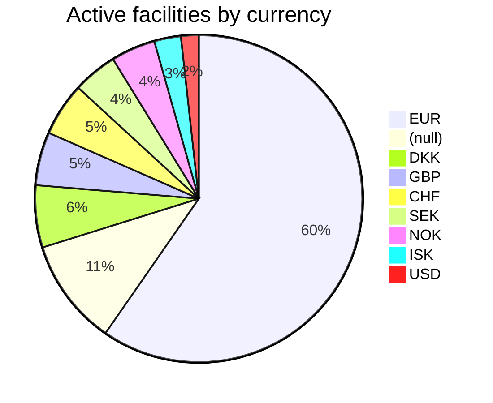

# Marts Guide

This is the layer designed for analyst consumption. Two dimensions, three facts, all in the `main_marts` schema of `prod.duckdb`. Star-schema joins are on `customer_id` and `facility_id`; every fact carries an `is_orphaned` flag for referential-integrity inspection.

> Numbers in the sample outputs below come from one run of the synthetic data generator (`SEED=42`). The shapes are stable; the exact counts will vary if you re-seed.

## Schema at a glance



For full column-level docs and lineage, run:

```bash
cd transformation/dbt && dbt docs generate && dbt docs serve
```

## Tables at a glance

| Table                              | Grain                            | Rows  | Use it to answer…                                                          |
|------------------------------------|----------------------------------|-------|----------------------------------------------------------------------------|
| `main_marts.dim_customers`         | one row per customer             | ~67   | who are our customers, ARR, total drawn, headcount/valuation drift         |
| `main_marts.dim_credit_facilities` | one row per credit facility      | ~114  | facility limits, utilization, status mix                                   |
| `main_marts.fct_drawdowns`         | one row per drawdown event       | ~324  | drawdown volume over time, time-to-first-drawdown, currency mix            |
| `main_marts.fct_repayments`        | one row per scheduled repayment  | ~1256 | scheduled vs actual repayment, lateness (`scheduled_vs_actual_lag_days`)   |
| `main_marts.fct_fx_transactions`   | one row per FX conversion        | ~1261 | FX volume by currency pair, customer FX activity                           |

> **Always filter `is_orphaned = FALSE` when aggregating fact tables.** Orphan rows are kept on purpose so you can inspect FK breakage, but they will skew KPIs.

## Quick start

If you don't already have `prod.duckdb` locally, pull the latest CI build:

```bash
aws s3 cp "s3://${S3_BUCKET}/state/prod.duckdb" transformation/dbt/prod.duckdb
```

(or build it from scratch — see [`docs/setup.md` step 4](setup.md#4-build-the-warehouse-with-dbt).)

Then open it with the DuckDB CLI:

```bash
duckdb transformation/dbt/prod.duckdb
```

The five examples below are ordered roughly by ambition — start with the customers query and work down.

---

### 1. Top customers by facility limit

```sql
SELECT company_name, lifetime_arr, total_facility_limit, total_drawn_amount
FROM main_marts.dim_customers
ORDER BY total_facility_limit DESC NULLS LAST
LIMIT 5;
```

```
           company_name  lifetime_arr  total_facility_limit  total_drawn_amount
         Patton-Jenkins           0.0           286869500.0           534348.06
           Figueroa PLC           0.0           141121800.0          1153929.39
Martin, Rose and Obrien           0.0            41185600.0                0.00
             Walker Ltd           0.0            17848221.0          7630743.58
         Harris-Walters           0.0            16041059.0         21197551.74
```

> Notice `lifetime_arr` is 0 for the top 5. The synthetic generator seeds ARR sparsely; this is *real-data-shaped* — not every customer has a billing relationship the moment you snapshot the warehouse. Replace `total_facility_limit` with `lifetime_arr` to see the (smaller) set of customers that do.

### 2. Facility portfolio summary

```sql
SELECT facility_status,
       COUNT(*)                      AS facilities,
       SUM(facility_limit)           AS total_limit,
       AVG(current_utilization_pct)  AS avg_util_pct
FROM main_marts.dim_credit_facilities
GROUP BY facility_status
ORDER BY facilities DESC;
```

```
facility_status  facilities  total_limit  avg_util_pct
         active          93 1047335404.8    232.79
         closed          21  403787141.8    195.03
```

> `avg_util_pct > 100` is intentional in this dataset — the generator produces over-utilized facilities to test edge-case rendering. In production this would be the signal for a hard limit-breach alert.

### 3. Drawdowns over time

```sql
SELECT date_trunc('month', drawdown_date) AS month,
       COUNT(*)                           AS drawdowns,
       SUM(amount)                        AS total_amount
FROM main_marts.fct_drawdowns
WHERE is_orphaned = FALSE
GROUP BY month
ORDER BY month;
```

```
     month  drawdowns  total_amount
2026-01-01        113  1.191e+09
       NaT         15  3.543e+08    -- rows with NULL drawdown_date (data quality)
```

> The `NaT` month is data-quality output: 15 drawdowns have a NULL `drawdown_date`. Fold that into a `WHERE drawdown_date IS NOT NULL` if you only want clean ones.

### 4. Repayment lateness distribution

```sql
SELECT
  CASE
    WHEN scheduled_vs_actual_lag_days <= 0  THEN 'on time / early'
    WHEN scheduled_vs_actual_lag_days <= 7  THEN '1-7 days late'
    WHEN scheduled_vs_actual_lag_days <= 30 THEN '8-30 days late'
    ELSE                                         '30+ days late'
  END                  AS bucket,
  COUNT(*)             AS repayments,
  SUM(actual_amount)   AS total_amount
FROM main_marts.fct_repayments
WHERE is_orphaned = FALSE AND actual_date IS NOT NULL
GROUP BY bucket
ORDER BY MIN(scheduled_vs_actual_lag_days);
```

```
         bucket  repayments  total_amount
on time / early         153  405,408,122
  1-7 days late         170  188,896,496
 8-30 days late          43   22,334,616
  30+ days late          35   11,450,852
```



> The "1-7 days late" bucket is the largest by count — typical for B2B repayment behaviour where a few days drift is the norm.

### 5. FX activity by currency pair

```sql
SELECT currency_pair,
       COUNT(*)            AS transactions,
       SUM(notional_base)  AS total_notional_base
FROM main_marts.fct_fx_transactions
WHERE is_orphaned = FALSE
GROUP BY currency_pair
ORDER BY transactions DESC
LIMIT 6;
```

```
currency_pair  transactions  total_notional_base
      CAD/EUR            52         237,238,915
      EUR/DKK            48         197,964,604
      CHF/EUR            47         153,708,183
      EUR/CAD            45         115,238,681
      GBP/EUR            45         107,618,623
      EUR/NOK            44         209,647,492
```

> EUR is on one side of every top pair — the dataset simulates a Europe-based fintech, and the generator routes 80 % of FX through EUR.

---

## More examples — by intent

### Concentration risk

> "How concentrated is our book? What share of facility limits sits in the top 5 customers?"

```sql
WITH ranked AS (
  SELECT customer_id,
         total_facility_limit,
         total_facility_limit / SUM(total_facility_limit) OVER () AS pct_of_total
  FROM main_marts.dim_customers
  WHERE total_facility_limit > 0
)
SELECT customer_id, total_facility_limit, ROUND(pct_of_total * 100, 2) AS pct_of_total
FROM ranked
ORDER BY total_facility_limit DESC
LIMIT 5;
```

```
                         customer_id  total_facility_limit  pct_of_total
c0094592-09fc-431d-a751-9543c7798b9b           286,869,500          45.61
833583c4-4a87-4c51-a692-1a19b8d03764           141,121,800          22.44
9eb303fc-5bbf-457a-bca4-5560e2192c4c            41,185,600           6.55
96028111-0021-4708-9bc0-2b33223385e3            17,848,221           2.84
014416d5-3d83-45b0-aa09-9385c8b3c508            16,041,059           2.55
```

> One customer holds 45 % of the entire facility book. That's a synthetic-data quirk, but in production this is exactly the signal the credit-risk team would alert on.

### Currency mix

```sql
SELECT COALESCE(currency, '(null)') AS currency,
       COUNT(*)                     AS facilities,
       SUM(facility_limit)          AS total_limit
FROM main_marts.dim_credit_facilities
GROUP BY currency
ORDER BY facilities DESC;
```

```
currency  facilities  total_limit
     EUR          68  519,368,192
  (null)          12  201,335,766    -- unset currency = data quality issue
     DKK           7  291,479,009
     GBP           6  304,944,081
     CHF           6   38,041,387
     SEK           5   18,350,025
     NOK           5   51,019,645
     ISK           3   23,559,080
     USD           2    3,025,363
```



### Customer 360

> "Show me everything we know about one customer."

```sql
SELECT *
FROM main_marts.dim_customers
WHERE customer_id = 'c0094592-09fc-431d-a751-9543c7798b9b';
```

For their drawdown history:

```sql
SELECT drawdown_date, amount, currency, status
FROM main_marts.fct_drawdowns
WHERE customer_id = 'c0094592-09fc-431d-a751-9543c7798b9b'
  AND is_orphaned = FALSE
ORDER BY drawdown_date;
```

For their repayment health:

```sql
SELECT
  COUNT(*)                                                AS scheduled_repayments,
  COUNT(*) FILTER (WHERE actual_date IS NOT NULL)         AS paid_repayments,
  AVG(scheduled_vs_actual_lag_days)                       AS avg_lag_days
FROM main_marts.fct_repayments
WHERE customer_id = 'c0094592-09fc-431d-a751-9543c7798b9b'
  AND is_orphaned = FALSE;
```

### Time to first drawdown

> "How long do customers wait between facility approval and their first drawdown?"

```sql
SELECT
  MIN(days_since_facility_approval) AS min_days,
  AVG(days_since_facility_approval) AS avg_days,
  MAX(days_since_facility_approval) AS max_days
FROM main_marts.fct_drawdowns
WHERE is_orphaned = FALSE;
```

```
 min_days  avg_days  max_days
       40    377.5      731
```

> Average of ~12 months between approval and drawdown is unusually high — the generator simulates patient-capital style products where customers draw down sporadically.

### Data-quality dashboard — orphan census

> Every fact table carries `is_orphaned` for FKs that don't resolve. Track it.

```sql
SELECT 'drawdowns'       AS entity,
       COUNT(*) FILTER (WHERE is_orphaned)        AS orphans,
       COUNT(*)                                    AS total,
       ROUND(100.0 * COUNT(*) FILTER (WHERE is_orphaned) / COUNT(*), 1) AS orphan_pct
FROM main_marts.fct_drawdowns
UNION ALL SELECT 'repayments',      COUNT(*) FILTER (WHERE is_orphaned), COUNT(*), ROUND(100.0 * COUNT(*) FILTER (WHERE is_orphaned) / COUNT(*), 1) FROM main_marts.fct_repayments
UNION ALL SELECT 'fx_transactions', COUNT(*) FILTER (WHERE is_orphaned), COUNT(*), ROUND(100.0 * COUNT(*) FILTER (WHERE is_orphaned) / COUNT(*), 1) FROM main_marts.fct_fx_transactions;
```

```
         entity  orphans  total  orphan_pct
      drawdowns      196    324       60.5
     repayments      760   1256       60.5
fx_transactions      572   1261       45.4
```

> 60 % orphan rate is *intentional* in the synthetic dataset — the generator emits late-arriving FK references the same way real source systems do. In your dbt tests, the `relationships` test on each FK is set to `severity: warn` for exactly this reason: orphans are normal, you want a number, not a pipeline failure.

### Repayment health per customer

```sql
SELECT
  c.company_name,
  COUNT(r.repayment_id)                             AS scheduled,
  COUNT(*) FILTER (WHERE r.actual_date IS NOT NULL) AS paid,
  ROUND(AVG(r.scheduled_vs_actual_lag_days), 1)     AS avg_lag_days
FROM main_marts.dim_customers c
LEFT JOIN main_marts.fct_repayments r USING (customer_id)
WHERE r.is_orphaned = FALSE
GROUP BY c.company_name
HAVING COUNT(r.repayment_id) > 5
ORDER BY avg_lag_days DESC NULLS LAST
LIMIT 10;
```

> Returns the 10 customers with the highest average repayment lag — the natural "watchlist" for collections.

---

## Common patterns

### Joining a fact to a dimension

Every fact has `customer_id` and (for lending facts) `facility_id`. Always set `is_orphaned = FALSE` on the fact side:

```sql
SELECT c.company_name, SUM(d.amount) AS total_drawn
FROM main_marts.fct_drawdowns d
JOIN main_marts.dim_customers c USING (customer_id)
WHERE d.is_orphaned = FALSE
GROUP BY c.company_name;
```

### Time bucketing

DuckDB has first-class date arithmetic. Common patterns:

```sql
date_trunc('month', drawdown_date)              -- bucket to month
drawdown_date >= current_date - INTERVAL 6 MONTH-- last 6 months
date_diff('day', due_date, actual_date)         -- days between
```

### Filtering nulls without surprising the optimizer

```sql
WHERE column IS NOT NULL
-- not: WHERE column = column   (a common anti-pattern)
```

### Counting categories conditionally

```sql
SELECT
  COUNT(*) FILTER (WHERE status = 'completed') AS completed,
  COUNT(*) FILTER (WHERE status = 'pending')   AS pending
FROM main_marts.fct_drawdowns;
```

`FILTER` is cleaner and faster than `SUM(CASE WHEN ... THEN 1 ELSE 0 END)`.

---

## Don't want to write SQL?

`analytics/query.py` takes a natural-language question, asks Claude for SQL using the same schema descriptions you see above, runs it against `prod.duckdb`, and prints the result.

```bash
python analytics/query.py "Top 10 customers by total drawn amount"
python analytics/query.py --show-sql "Which currency pair has the most FX volume in the last quarter?"
python analytics/query.py "How many active facilities are over 100% utilized?"
```

See [`analytics/README.md`](../analytics/README.md) for setup, full example list, and limits.
